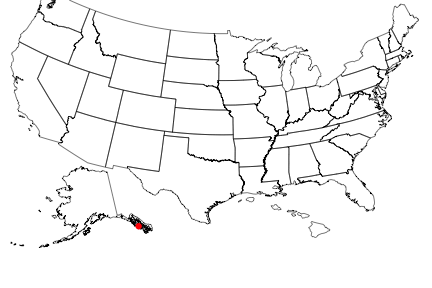

rbison
======

Wrapper to the USGS Bison API. 

### Info

See [here](http://bison.usgs.ornl.gov/services.html) for API docs for the BISON API.


### Quick start

#### Install rbison


```r
install.packages("devtools")
library(devtools)
install_github("rbison", "ropensci")
library(rbison)
```


Notice that the function `bisonmap` automagically selects the map extent to plot for you, 
being one of the contiguous lower 48 states, or the lower 48 plus AK and HI, or a global map

#### If some or all points outside the US, a global map is drawn, and throws a warning. . You may want to make sure the occurrence lat/long coordinates are correct.
##### get data

```r
out <- bison(species = "Phocoenoides dalli dalli", count = 10)
```


##### inspect summary

```r
bison_data(out)
```

```
  total specimen
1     7        7
```


##### map occurrences

```r
bisonmap(out)
```

```
Some of your points are outside the US. Make sure the data is correct
```

 


####  All points within the US (including AK and HI)
##### get data

```r
out <- bison(species = "Bison bison", count = 600)
```


##### inspect summary

```r
bison_data(out)
```

```
  total observation fossil specimen unknown
1   781          38      4      722      17
```


##### map occurrences

```r
bisonmap(out)
```

 


####  All points within the contiguous 48 states
##### get data

```r
out <- bison(species = "Aquila chrysaetos", count = 600)
```


##### inspect summary

```r
bison_data(out)
```

```
  total observation fossil specimen literature unknown centroid
1 41780       39334     30     1664        118     634      904
```


##### map occurrences

```r
bisonmap(out)
```

 


####  With any data returned from a `bison` call, you can choose to plot county or state level data
##### Counties - using last data call for Aquila 

```r
bisonmap(out, tomap = "county")
```

 


##### States - using last data call for Aquila 

```r
bisonmap(out, tomap = "state")
```

 


####  You can also query BISON via their SOLR interface
##### The taxa service searches for and gives back taxonomic names


```r
bison_tax(query = "bear", method = "common_name")
```

```
$numFound
[1] 1

$names
        id scientific_name common_nameText common_name
1 16282430         Ursidae            Bear        Bear
2 16282430         Ursidae           Bears       Bears
3 16282430         Ursidae        Ursídeos    Ursídeos

$highlight
NULL

$facets
NULL
```


You can also do fuzzy searches like this (which you can't do using the `bison` function)


```r
bison_tax(query = "*bear")[1:2]
```

```
$numFound
[1] 21

$names
         id      scientific_name       common_nameText           common_name
1   6938279      Ailurus fulgens           Panda Chico           Panda Chico
2   6938279      Ailurus fulgens            Panda Rojo            Panda Rojo
3   6938279      Ailurus fulgens        Panda Éclatant        Panda Éclatant
4   6938279      Ailurus fulgens           Petit Panda           Petit Panda
5   6938279      Ailurus fulgens          Red Cat bear          Red Cat bear
6   6938279      Ailurus fulgens             Red Panda             Red Panda
7   6938279      Ailurus fulgens        Panda vermelho        Panda vermelho
8  16419884       Arctodus simus              Arctodus              Arctodus
9  16419884       Arctodus simus      Short faced bear      Short faced bear
10  6939768  Helarctos malayanus      Malayan Sun Bear      Malayan Sun Bear
11  6939768  Helarctos malayanus            Oso De Sol            Oso De Sol
12  6939768  Helarctos malayanus            Oso Malayo            Oso Malayo
13  6939768  Helarctos malayanus    Ours Des Cocotiers    Ours Des Cocotiers
14  6939768  Helarctos malayanus           Ours malais           Ours malais
15  6939768  Helarctos malayanus              Sun bear              Sun bear
16  6939768  Helarctos malayanus           Urso malaio           Urso malaio
17  6886968     Melursus ursinus          Oso Perezoso          Oso Perezoso
18  6886968     Melursus ursinus  Ours Lippu De L'Inde  Ours Lippu De L'Inde
19  6886968     Melursus ursinus   Ours Prochile Lippu   Ours Prochile Lippu
20  6886968     Melursus ursinus            Ours lippu            Ours lippu
21  6886968     Melursus ursinus          Urso beiçudo          Urso beiçudo
22  6886968     Melursus ursinus            Sloth Bear            Sloth Bear
23  6929840     Orycteropus afer               Antbear               Antbear
24  6929840     Orycteropus afer            Oryctérope            Oryctérope
25  6929840     Orycteropus afer              Aardvark              Aardvark
26  6929840     Orycteropus afer     Oryctérope du Cap     Oryctérope du Cap
27  7463441 Pyrrharctia isabella     banded woollybear     banded woollybear
28  7463441 Pyrrharctia isabella         isia isabelle         isia isabelle
29  7463444  Spilosoma virginica diacrisie de Virginie diacrisie de Virginie
30  7463444  Spilosoma virginica     yellow woollybear     yellow woollybear
31  6924909   Tremarctos ornatus           Andean Bear           Andean Bear
32  6924909   Tremarctos ornatus       Oso De Anteojos       Oso De Anteojos
33  6924909   Tremarctos ornatus          Oso Frontino          Oso Frontino
34  6924909   Tremarctos ornatus              Oso Real              Oso Real
35  6924909   Tremarctos ornatus            Ours Andin            Ours Andin
36  6924909   Tremarctos ornatus       Ours À Lunettes       Ours À Lunettes
37  6924909   Tremarctos ornatus       Ours à lunettes       Ours à lunettes
38  6924909   Tremarctos ornatus        Urso de óculos        Urso de óculos
39  6924909   Tremarctos ornatus       Spectacled Bear       Spectacled Bear
40 16282430              Ursidae                  Bear                  Bear
41 16282430              Ursidae                 Bears                 Bears
42 16282430              Ursidae              Ursídeos              Ursídeos
43 16204069                Ursus             Cave bear             Cave bear
44 16204069                Ursus     Ours des cavernes     Ours des cavernes
45 16204069                Ursus     Urso das cavernas     Urso das cavernas
46 16204069                Ursus        Ursus etruscus        Ursus etruscus
47 16204069                Ursus                 bears                 bears
```


And you can search by scientific name


```r
bison_tax(query = "helianthus", method = "scientific_name")
```

```
$numFound
[1] 1

$names
        id scientific_name common_nameText common_name
1 10457086      Helianthus      sunflowers  sunflowers
2 10457086      Helianthus       Hélianthe   Hélianthe
3 10457086      Helianthus       sunflower   sunflower

$highlight
NULL

$facets
NULL
```


##### The occurrence service searches by scientific names and gives back occurrence data similar to data given back by the `bison` function

Searching for data and looking at output


```r
out <- bison_solr(scientific_name = "Ursus americanus", state_code = "New Mexico", rows = 50, fl = "occurrence_date,scientific_name")
bison_data(input = out)
```

```
$num_found
[1] 4166

$records
   occurrence_date  scientific_name
1       2008-10-19 Ursus americanus
2       2009-09-13 Ursus americanus
3       2009-08-19 Ursus americanus
4       2009-08-19 Ursus americanus
5       2008-10-14 Ursus americanus
6       2008-09-03 Ursus americanus
7       2009-08-16 Ursus americanus
8       2009-10-12 Ursus americanus
9       2008-08-18 Ursus americanus
10      2008-10-03 Ursus americanus
11      2009-08-16 Ursus americanus
12      2009-08-27 Ursus americanus
13      2009-10-14 Ursus americanus
14      2008-08-17 Ursus americanus
15      2008-08-17 Ursus americanus
16      2008-08-18 Ursus americanus
17      2009-08-29 Ursus americanus
18      2009-10-09 Ursus americanus
19      2008-09-01 Ursus americanus
20      2008-09-08 Ursus americanus
21      2008-09-07 Ursus americanus
22      2008-09-29 Ursus americanus
23      2009-10-24 Ursus americanus
24      2009-09-06 Ursus americanus
25      2009-09-07 Ursus americanus
26      2008-08-17 Ursus americanus
27      2008-11-13 Ursus americanus
28      2008-10-25 Ursus americanus
29      2003-06-16 Ursus americanus
30      2008-05-13 Ursus americanus
31      2009-08-29 Ursus americanus
32      2009-10-09 Ursus americanus
33      2009-09-05 Ursus americanus
34      2008-11-07 Ursus americanus
35      2009-10-05 Ursus americanus
36      2008-10-16 Ursus americanus
37      2009-09-18 Ursus americanus
38      2002-07-25 Ursus americanus
39      2009-10-06 Ursus americanus
40      2009-10-10 Ursus americanus
41      2008-10-04 Ursus americanus
42      2009-09-26 Ursus americanus
43      1958-09-14 Ursus americanus
44      2009-08-17 Ursus americanus
45      2009-10-14 Ursus americanus
46      2008-09-23 Ursus americanus
47      2008-10-03 Ursus americanus
48      2009-10-07 Ursus americanus
49      2008-08-23 Ursus americanus
50      2008-08-01 Ursus americanus

$highlight
NULL

$facets
NULL
```


Mapping the data


```r
out <- bison_solr(scientific_name = "Ursus americanus", rows = 200)
bisonmap(out)
```

 

