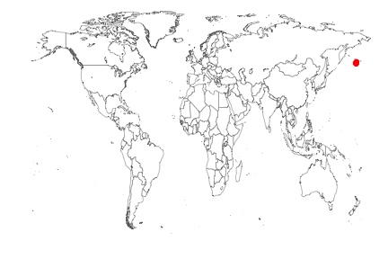
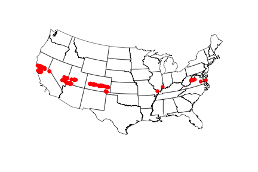
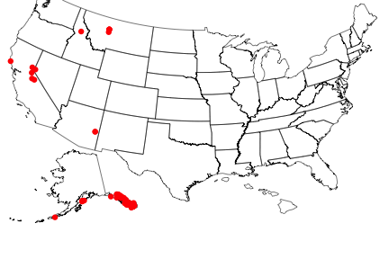

rbison
======

Wrapper to the USGS Bison API. 

### Info

See [here](http://bison.usgs.ornl.gov/services.html) for API docs for the BISON API.


### Quick start

#### Install rbison


```r
# install.packages('devtools') library(devtools) install_github('rbison',
# 'ropensci')
library(rbison)
```


Notice that the function `bisonmap` automagically selects the map extent to plot for you, 
being one of the contiguous lower 48 states, or the lower 48 plus AK and HI, or a global map

#### If some or all points outside the US, a global map is drawn, and throws a warning. . You may want to make sure the occurrence lat/long coordinates are correct.
##### get data

```r
out <- bison(species = "Phocoenoides dalli dalli", count = 10)
```

```
Loading required package: rjson
```


##### inspect summary

```r
bison_data(out)
```

```
  total specimen
1     7        7
```


##### map occurrences

```r
bisonmap(out)
```

```
Some of your points are outside the US. Make sure the data is correct
```

 


####  All points within the US (including AK and HI)
##### get data

```r
out <- bison(species = "Bison bison", count = 600)
```


##### inspect summary

```r
bison_data(out)
```

```
  total observation fossil specimen unknown
1   781          38      4      722      17
```


##### map occurrences

```r
bisonmap(out)
```

 


####  All points within the contiguous 48 states
##### get data

```r
out <- bison(species = "Aquila chrysaetos", count = 600)
```


##### inspect summary

```r
bison_data(out)
```

```
  total observation fossil specimen literature unknown centroid
1 41780       39334     30     1664        118     634      904
```


##### map occurrences

```r
bisonmap(out)
```

 


####  With any data returned from a `bison` call, you can choose to plot county or state level data
##### Counties - using last data call for Aquila 

```r
bisonmap(out, tomap = "county")
```

 


##### States - using last data call for Aquila 

```r
bisonmap(out, tomap = "state")
```

 


####  You can also query BISON via their SOLR interface
##### The taxa service searches for and gives back taxonomic names

```r
bison_solr_tax(query = "bear", method = "common_name")
```

```
$numFound
[1] 1

$names
$names$id
[1] "16282502"

$names$scientific_name
[1] "Ursidae"

$names$common_nameText
 [1] "Ariu"        "Arth"        "Arzh"        "Bear"        "bears"      
 [6] "Beer"        "Beir"        "Bera"        "Bere"        "Beren"      
[11] "Bero"        "Beruang"     "Bieren"      "Biruang"     "Bjarnir"    
[16] "Boare"       "Bruwang"     "Bur kondi"   "cribe"       "Dabbar beya"
[21] "Dubu"        "Hartz"       "Jukumari"    "Karhut"      "Karulased"  
[26] "Lokiniai"    "Lonso"       "Lous"        "Mathan"      "Medvedi"    
[31] "Medvjed"     "Medvjedi"    "Oso"         "Pea"         "Shash"      
[36] "Ukumari"     "Urs"         "Ursida"      "Urso"        "Ursídeos"   
[41] "Urzo"       

$names$common_name
 [1] "Ariu"        "Arth"        "Arzh"        "Bear"        "bears"      
 [6] "Beer"        "Beir"        "Bera"        "Bere"        "Beren"      
[11] "Bero"        "Beruang"     "Bieren"      "Biruang"     "Bjarnir"    
[16] "Boare"       "Bruwang"     "Bur kondi"   "cribe"       "Dabbar beya"
[21] "Dubu"        "Hartz"       "Jukumari"    "Karhut"      "Karulased"  
[26] "Lokiniai"    "Lonso"       "Lous"        "Mathan"      "Medvedi"    
[31] "Medvjed"     "Medvjedi"    "Oso"         "Pea"         "Shash"      
[36] "Ukumari"     "Urs"         "Ursida"      "Urso"        "Ursídeos"   
[41] "Urzo"       
```

You can also do fuzzy searches like this (which you can't do using the `bison` function)

```r
bison_solr_tax(query = "*bear")[1:2]
```

```
$numFound
[1] 22

$names1
$names1$id
[1] "6938274"

$names1$scientific_name
[1] "Ailurus fulgens"

$names1$common_nameText
 [1] "Lesser Panda"    "Panda Chico"     "Panda Rojo"     
 [4] "Panda Éclatant"  "Petit Panda"     "Red Cat bear"   
 [7] "Crveni panda"    "Kleine panda"    "Kleiner Panda"  
[10] "Kultapanda"      "Malgranda pando" "Panda Coch"     
[13] "Panda gorri"     "Panda Merah"     "Panda rua"      
[16] "Panda russu"     "Panda ruz"       "Panda vermelho" 
[19] "Panda vermell"   "Pulang panda"    "Punane panda"   
[22] "Red Panda"      

$names1$common_name
 [1] "Lesser Panda"    "Panda Chico"     "Panda Rojo"     
 [4] "Panda Éclatant"  "Petit Panda"     "Red Cat bear"   
 [7] "Crveni panda"    "Kleine panda"    "Kleiner Panda"  
[10] "Kultapanda"      "Malgranda pando" "Panda Coch"     
[13] "Panda gorri"     "Panda Merah"     "Panda rua"      
[16] "Panda russu"     "Panda ruz"       "Panda vermelho" 
[19] "Panda vermell"   "Pulang panda"    "Punane panda"   
[22] "Red Panda"      
```

And you can search by scientific name

```r
bison_solr_tax(query = "helianthus", method = "scientific_name")
```

```
$numFound
[1] 1

$names
$names$id
[1] "17149412"

$names$scientific_name
[1] "Helianthus"

$names$common_nameText
[1] "Auringonkukat" "Helianto"      "Hélianthe"     "Sanruusen"    
[5] "Sonnenblumen"  "sunflower"     "sunflowers"   

$names$common_name
[1] "Auringonkukat" "Helianto"      "Hélianthe"     "Sanruusen"    
[5] "Sonnenblumen"  "sunflower"     "sunflowers"   
```


##### The occurrence service searches by scientific names and gives back occurrence data similar to data given back by the `bison` function

Searching for data and looking at output


```r
out <- bison_solr_occ(scientific_name = '"Ursus americanus"', state_code = '"New Mexico"', 
    rows = 50, fl = "occurrence_date,scientific_name")
head( bison_data(input = out) )
```

```
   occurrence_date  scientific_name
1       1935-06-20 Ursus americanus
2       2011-08-23 Ursus americanus
3             <NA> Ursus americanus
4             <NA> Ursus americanus
5             <NA> Ursus americanus
6       1992-08-11 Ursus americanus
```


Mapping the data


```r
out <- bison_solr_occ(scientific_name = '"Ursus americanus"', rows = 200)
bisonmap(out)
```

 