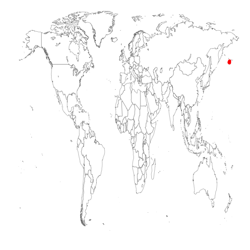
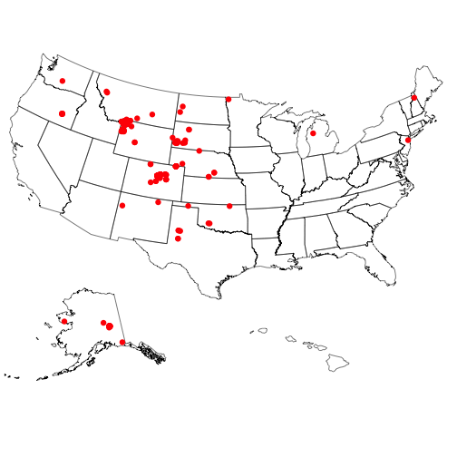
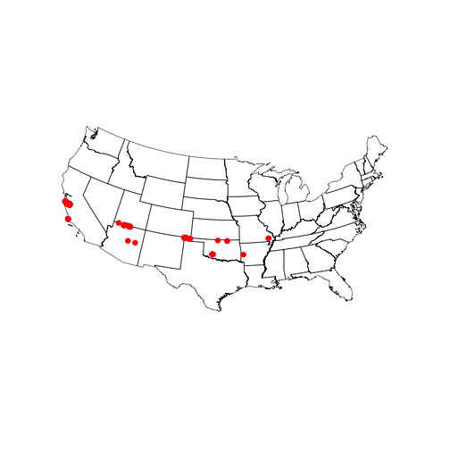
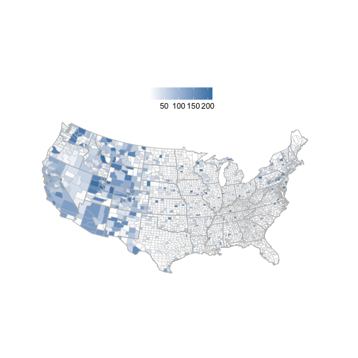
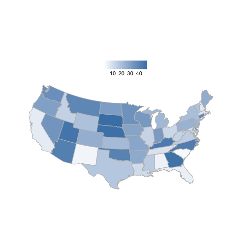
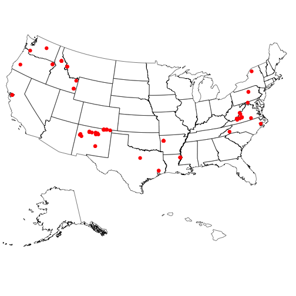

rbison
======


[](https://travis-ci.org/ropensci/rbison)
[](https://ci.appveyor.com/project/karthik/rbison)
[](https://github.com/metacran/cranlogs.app)
[](http://cran.rstudio.com/web/packages/rbison)

Wrapper for the USGS Bison API.

### Info

See [here](http://bison.usgs.ornl.gov/doc/services.jsp) for API docs for the BISON API.


### Quick start

#### Install rbison

From CRAN


```r
install.packages("rbison")
```

Or the development version from Github


```r
install.packages("devtools")
devtools::install_github("ropensci/rbison")
library('rbison')
```

Load package


```r
library("rbison")
```

Notice that the function `bisonmap` automagically selects the map extent to plot for you, being one of the contiguous lower 48 states, or the lower 48 plus AK and HI, or a global map. If some or all points outside the US, a global map is drawn, and throws a warning. . You may want to make sure the occurrence lat/long coordinates are correct.

##### get data


```r
out <- bison(species = "Phocoenoides dalli dalli", count = 10)
```


##### inspect summary


```r
out$summary
#>   total specimen unknown
#> 1     7        6       1
```

##### map occurrences


```r
bisonmap(out)
```

 

####  All points within the US (including AK and HI)
##### get data


```r
out <- bison(species = "Bison bison", count = 600)
```


##### inspect summary


```r
out$summary
#>   total observation fossil specimen unknown centroid
#> 1  1320         181    162      738     239        1
```

##### map occurrences


```r
bisonmap(out)
```

 

####  All points within the contiguous 48 states
##### get data


```r
out <- bison(species = "Aquila chrysaetos", count = 600)
```


##### inspect summary


```r
out$summary
#>   total observation fossil specimen literature unknown centroid
#> 1 91482       80582    118      785        556    9441        1
```


##### map occurrences


```r
bisonmap(out)
```

 


####  With any data returned from a `bison` call, you can choose to plot county or state level data
##### Counties - using last data call for Aquila


```r
bisonmap(out, tomap = "county")
```

 

##### States - using last data call for Aquila


```r
bisonmap(out, tomap = "state")
```

 


####  You can also query BISON via their SOLR interface
##### The taxa service searches for and gives back taxonomic names


```r
bison_tax(query = "*bear")
#> $numFound
#> [1] 12
#> 
#> $names
#> Source: local data frame [10 x 2]
#> 
#>          vernacularName    lc_vernacularName
#> 1  Louisiana black bear Louisiana black bear
#> 2          grizzly bear         grizzly bear
#> 3     yellow woollybear    yellow woollybear
#> 4     banded woollybear    banded woollybear
#> 5    Asiatic black bear   Asiatic black bear
#> 6           Kodiak bear          Kodiak bear
#> 7      black-ended bear     black-ended bear
#> 8   American black bear  American black bear
#> 9            black bear           black bear
#> 10   yellow woolly bear   yellow woolly bear
#> 
#> $highlight
#> NULL
#> 
#> $facets
#> NULL
```

And you can search by scientific name


```r
bison_tax(query = "Helianthus*", method = "scientificName")
#> $numFound
#> [1] 183
#> 
#> $names
#> Source: local data frame [10 x 1]
#> 
#>                        scientificName
#> 1   Helianthus divaricatus latifolius
#> 2              Helianthus decapetalus
#> 3                 Helianthus ambiguus
#> 4                Helianthus luxurians
#> 5                Helianthus arenicola
#> 6               Helianthus atrorubens
#> 7              Helianthus tenuifolius
#> 8        Helianthus petiolaris phenax
#> 9  Helianthus angustifolius nuttallii
#> 10          Helianthus trachelifolius
#> 
#> $highlight
#> NULL
#> 
#> $facets
#> NULL
```

##### The occurrence service searches by scientific names and gives back occurrence data similar to data given back by the `bison` function

Searching for data and looking at output


```r
bison_solr(scientificName = "Ursus americanus", state_code = "New Mexico", rows = 50, fl = "eventDate,scientificName")
#> $num_found
#> [1] 5370
#> 
#> $points
#>            eventDate   scientificName
#> 1  2012-05-19T00:00Z Ursus americanus
#> 2  2012-06-23T00:00Z Ursus americanus
#> 3  2009-10-17T14:54Z Ursus americanus
#> 4  1982-11-10T00:00Z Ursus americanus
#> 5  2014-08-14T23:30Z Ursus americanus
#> 6  2010-06-08T00:00Z Ursus americanus
#> 7  2012-06-12T23:10Z Ursus americanus
#> 8  1941-11-25T00:00Z Ursus americanus
#> 9  1941-11-25T00:00Z Ursus americanus
#> 10 2014-06-20T00:00Z Ursus americanus
#> 11 2013-08-18T00:50Z Ursus americanus
#> 12              <NA> Ursus americanus
#> 13 1927-10-18T00:00Z Ursus americanus
#> 14 1940-12-14T00:00Z Ursus americanus
#> 15 2013-11-25T00:00Z Ursus americanus
#> 16 2013-11-25T00:00Z Ursus americanus
#> 17 2013-09-18T00:00Z Ursus americanus
#> 18 2009-07-02T00:00Z Ursus americanus
#> 19 1976-05-04T00:00Z Ursus americanus
#> 20 2013-09-11T23:55Z Ursus americanus
#> 21 2011-05-02T10:24Z Ursus americanus
#> 22 2014-10-22T23:36Z Ursus americanus
#> 23 2014-09-19T10:13Z Ursus americanus
#> 24 2013-10-06T05:01Z Ursus americanus
#> 25 2014-09-22T00:07Z Ursus americanus
#> 26 1929-10-19T00:00Z Ursus americanus
#> 27 1927-10-26T00:00Z Ursus americanus
#> 28 2006-08-22T00:00Z Ursus americanus
#> 29 2013-05-23T04:31Z Ursus americanus
#> 30 2010-11-02T00:00Z Ursus americanus
#> 31 1927-10-29T00:00Z Ursus americanus
#> 32 1935-10-29T00:00Z Ursus americanus
#> 33 2013-09-23T23:43Z Ursus americanus
#> 34 2014-05-11T03:45Z Ursus americanus
#> 35 2012-05-13T00:00Z Ursus americanus
#> 36 2013-08-02T00:00Z Ursus americanus
#> 37 1950-09-01T00:00Z Ursus americanus
#> 38 1950-09-01T00:00Z Ursus americanus
#> 39 2013-12-25T00:00Z Ursus americanus
#> 40 1949-10-15T00:00Z Ursus americanus
#> 41 2014-02-10T06:35Z Ursus americanus
#> 42 2012-06-07T04:09Z Ursus americanus
#> 43 2006-07-25T06:27Z Ursus americanus
#> 44 2008-05-10T00:00Z Ursus americanus
#> 45 2005-07-24T08:20Z Ursus americanus
#> 46 2011-06-20T00:00Z Ursus americanus
#> 47 2013-11-25T00:00Z Ursus americanus
#> 48 2013-11-25T00:00Z Ursus americanus
#> 49 2013-11-25T00:00Z Ursus americanus
#> 50 2014-06-17T00:00Z Ursus americanus
#> 
#> $highlight
#> NULL
#> 
#> $facets
#> $facets$facet_queries
#> NULL
#> 
#> $facets$facet_fields
#> NULL
#> 
#> $facets$facet_dates
#> NULL
#> 
#> $facets$facet_ranges
#> NULL
#> 
#> 
#> attr(,"class")
#> [1] "bison_solr"
```

Mapping the data


```r
out <- bison_solr(scientificName = "Ursus americanus", rows = 200)
bisonmap(out)
```

 

## Meta

* Please [report any issues or bugs](https://github.com/ropensci/rbison/issues).
* License: MIT
* Get citation information for `rbison` in R doing `citation(package = 'rbison')`

This package is part of a richer suite called [SPOCC Species Occurrence Data](https://github.com/ropensci/spocc), along with several other packages, that provide access to occurrence records from multiple databases. We recommend using SPOCC as the primary R interface to rbison unless your needs are limited to this single source.

[](http://ropensci.org)
