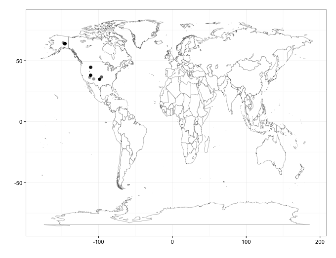

rbison
======

Wrapper to the USGS Bison API. 

### Info

See [here](http://bison.usgs.ornl.gov/services.html) for API docs for the BISON API.


### Quick start

#### Install rbison

```ruby
install.packages("devtools")
library(devtools)
install_github("rbison", "ropensci")
library(rbison)
```

#### Query for bison, then plot the points

```ruby
out <- bison(species="Bison bison", type="scientific_name", start=0, count=50)
bisonmap(input=out)
```

