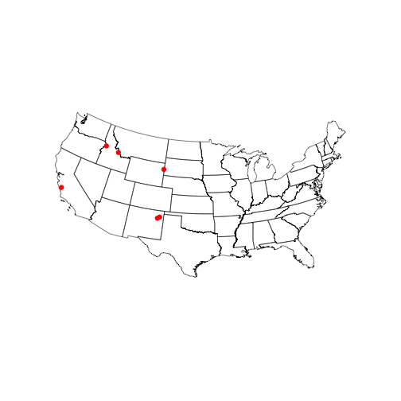
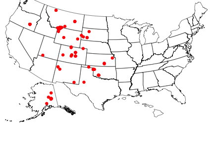
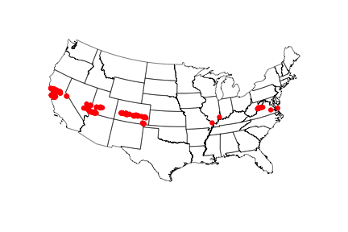
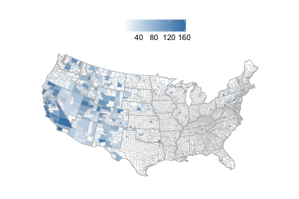

<!--
%\VignetteEngine{knitr}
%\VignetteIndexEntry{An R Markdown Vignette made with knitr}
-->

rbison vignette - wrapper to the USGS BISON API
======

### About the package

`rbison` is an R package to search and retrieve data from the USGS BISON service. `rbison` wraps R code around the BISON API to allow you to talk to the BISON database from R. 

BISON has occurrence data for the US only. 

BISON is a node of the Global Biodiversity Information Facility (GBIF) - i.e., you can get data that's available in BISON via GBIF instead if you want. 

********************

### Info

See [here](http://bison.usgs.ornl.gov/services.html) for API docs for the BISON API.

********************

### Quick start

#### Install rbison


```r
# install.packages('devtools'); library(devtools);
# install_github('rbison', 'ropensci')
library(rbison)
library(sp)
library(plyr)
library(httr)
library(rjson)
library(gridExtra)
library(mapproj)
library(ggplot2)
library(maps)
library(rgeos)
library(rgdal)
```


Notice that the function `bisonmap` automagically selects the map extent to plot for you, 
being one of the contiguous lower 48 states, or the lower 48 plus AK and HI, or a global map

#### If some or all points outside the US, a global map is drawn, and throws a warning. . You may want to make sure the occurrence lat/long coordinates are correct.
##### get data

```r
out <- bison(species = "Helianthus annuus", count = 10)
```


##### inspect summary

```r
bison_data(out)
```

```
  total observation fossil specimen literature unknown living centroid
1  4424          13    102     1303       1106    1892      8     1106
```


##### map occurrences

```r
bisonmap(out)
```

 


********************

#### All points within the US (including AK and HI)
##### get data

```r
out <- bison(species = "Bison bison", count = 600)
```


##### inspect summary

```r
bison_data(out)
```

```
  total observation fossil specimen unknown
1   781          38      4      722      17
```


##### map occurrences

```r
bisonmap(out)
```

 


********************

####  All points within the contiguous 48 states
##### get data

```r
out <- bison(species = "Aquila chrysaetos", count = 600)
```


##### inspect summary

```r
bison_data(out)
```

```
  total observation fossil specimen literature unknown centroid
1 41780       39334     30     1664        118     634      904
```


##### map occurrences

```r
bisonmap(out)
```

 


********************

####  With any data returned from a `bison` call, you can choose to plot county or state level data
##### Counties - using last data call for Aquila 

```r
bisonmap(out, tomap = "county")
```

 


##### States - using last data call for Aquila 

```r
bisonmap(out, tomap = "state")
```

 


********************

####  Constrain search with county IDs or bounding boxes

##### Constrain search to a certain county.

Check out [this site](http://www.epa.gov/enviro/html/codes/state.html) to get state and county fips codes. Fips codes are like so: First two digits are the state code - last three are the county code. For example the *06* in  06037 is the state of California, and the *037* is the Los Angeles county.


```r
out <- bison(species = "Helianthus annuus", countyFips = 6037)

# Inspect summary
bison_data(out)
```

```
  total observation fossil specimen literature unknown centroid
1    23           1      3       12          1       6        1
```

```r

# By default, the query only returned 10 records
bison_data(out, "data_df")
```

```
          id              name longitude latitude
1  832095838 Helianthus annuus    -118.4    33.39
2  687026030 Helianthus annuus    -118.2    34.09
3   40886954 Helianthus annuus    -118.9    34.80
4   40886955 Helianthus annuus    -118.9    34.80
5   67195635 Helianthus annuus    -118.8    34.70
6   67195791 Helianthus annuus    -118.5    34.30
7   67195582 Helianthus annuus    -118.4    34.04
8   40886953 Helianthus annuus    -118.1    34.70
9   40886951 Helianthus annuus    -118.1    34.70
10  40886950 Helianthus annuus    -118.1    34.70
                             provider
1                         USDA PLANTS
2                     iNaturalist.org
3  US National Plant Germplasm System
4  US National Plant Germplasm System
5                                <NA>
6                                <NA>
7                                <NA>
8  US National Plant Germplasm System
9  US National Plant Germplasm System
10 US National Plant Germplasm System
```


Or specify county by its actual name - probably much easier. 


```r
out <- bison(species = "Helianthus annuus", county = "Los Angeles")

# Inspect summary
bison_data(out)
```

```
  total observation fossil specimen literature unknown centroid
1    23           1      3       12          1       6        1
```

```r

# By default, the query only returned 10 records
bison_data(out, "data_df")
```

```
          id              name longitude latitude
1  832095838 Helianthus annuus    -118.4    33.39
2  687026030 Helianthus annuus    -118.2    34.09
3   40886954 Helianthus annuus    -118.9    34.80
4   40886955 Helianthus annuus    -118.9    34.80
5   67195635 Helianthus annuus    -118.8    34.70
6   67195791 Helianthus annuus    -118.5    34.30
7   67195582 Helianthus annuus    -118.4    34.04
8   40886953 Helianthus annuus    -118.1    34.70
9   40886951 Helianthus annuus    -118.1    34.70
10  40886950 Helianthus annuus    -118.1    34.70
                             provider
1                         USDA PLANTS
2                     iNaturalist.org
3  US National Plant Germplasm System
4  US National Plant Germplasm System
5                                <NA>
6                                <NA>
7                                <NA>
8  US National Plant Germplasm System
9  US National Plant Germplasm System
10 US National Plant Germplasm System
```


`bison` will help you if you spell the name wrong, or use a partial name. The results are not printed below, but you would get a prompt asking you to pick between the two counties that start with *Los*.


```r
bison(species = "Helianthus annuus", county = "Los")
```


##### Constrain search to a amorphous area. 

Check out the Wikipedia page [here](http://en.wikipedia.org/wiki/Well-known_text) for an in depth look at the options, terminology, etc.


```r
out <- bison(species = "Helianthus annuus", aoi = "POLYGON((-111.06360117772908 38.84001566645886,-110.80542246679359 39.37707771107983,-110.20117441992392 39.17722368276862,-110.20666758398464 38.90844075244811,-110.63513438085685 38.67724220095734,-111.06360117772908 38.84001566645886))")

# Inspect summary
bison_data(out)
```

```
  total literature centroid
1     1          1        1
```

```r

# The data
bison_data(out, "data_df")
```

```
         id              name longitude latitude    provider
1 832098012 Helianthus annuus    -110.7    38.99 USDA PLANTS
```


##### Constrain search to a certain aoibbox.

An aoibbox uses the format minx,miny,maxx,maxy.


```r
out <- bison(species = "Helianthus annuus", aoibbox = "-120.31,35.81,-110.57,40.21")

# Inspect summary
bison_data(out)
```

```
  total observation fossil specimen literature unknown centroid
1   145           6      8       34         25      72       25
```

```r

# The data, by default, the query only returned 10 records
bison_data(out, "data_df")
```

```
           id              name longitude latitude    provider
1  1800986531 Helianthus annuus    -112.1    37.18       BISON
2  1800986532 Helianthus annuus    -112.1    37.18       BISON
3  1800986533 Helianthus annuus    -112.1    37.18       BISON
4  1800986534 Helianthus annuus    -112.1    37.18       BISON
5  1800986645 Helianthus annuus    -111.8    37.13       BISON
6  1800986646 Helianthus annuus    -111.8    37.13       BISON
7   832096828 Helianthus annuus    -118.4    38.54 USDA PLANTS
8   832098025 Helianthus annuus    -111.8    38.75 USDA PLANTS
9   832098012 Helianthus annuus    -110.7    38.99 USDA PLANTS
10  832098018 Helianthus annuus    -113.1    39.05 USDA PLANTS
```

