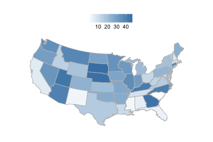

<!--
%\VignetteEngine{knitr}
%\VignetteIndexEntry{An R Markdown Vignette made with knitr}
-->

rbison vignette - wrapper to the USGS BISON API
======

### About the package

`rbison` is an R package to search and retrieve data from the USGS BISON service. `rbison` wraps R code around the BISON API to allow you to talk to the BISON database from R. 

BISON has occurrence data for the US only. 

BISON is a node of the Global Biodiversity Information Facility (GBIF) - i.e., you can get data that's available in BISON via GBIF instead if you want. 

********************

### Info

See [here](http://bison.usgs.ornl.gov/services.html) for API docs for the BISON API.

********************

### Quick start

#### Install rbison


```r
# install.packages('devtools'); library(devtools);
# install_github('rbison', 'ropensci')
library(rbison)
library(sp)
library(plyr)
library(httr)
library(rjson)
library(gridExtra)
```

```
Loading required package: grid
```

```r
library(mapproj)
```

```
Loading required package: maps
```

```r
library(ggplot2)
library(maps)
library(rgeos)
```

```
rgeos version: 0.2-17, (SVN revision 392) GEOS runtime version:
3.3.3-CAPI-1.7.4 Polygon checking: TRUE
```

```r
library(rgdal)
```

```
rgdal: version: 0.8-9, (SVN revision 470) Geospatial Data Abstraction
Library extensions to R successfully loaded Loaded GDAL runtime: GDAL
1.9.2, released 2012/10/08 Path to GDAL shared files:
/Library/Frameworks/R.framework/Versions/3.0/Resources/library/rgdal/gdal
Loaded PROJ.4 runtime: Rel. 4.8.0, 6 March 2012, [PJ_VERSION: 480] Path to
PROJ.4 shared files:
/Library/Frameworks/R.framework/Versions/3.0/Resources/library/rgdal/proj
```


Notice that the function `bisonmap` automagically selects the map extent to plot for you, 
being one of the contiguous lower 48 states, or the lower 48 plus AK and HI, or a global map

#### If some or all points outside the US, a global map is drawn, and throws a warning. . You may want to make sure the occurrence lat/long coordinates are correct.
##### get data

```r
out <- bison(species = "Helianthus annuus", count = 10)
```


##### inspect summary

```r
bison_data(out)
```

```
  total observation fossil specimen literature unknown living centroid
1  4422          11    102     1303       1106    1892      8     1106
```


##### map occurrences

```r
bisonmap(out)
```

 


********************

#### All points within the US (including AK and HI)
##### get data

```r
out <- bison(species = "Bison bison", count = 600)
```


##### inspect summary

```r
bison_data(out)
```

```
  total observation fossil specimen unknown
1   761          30      4      709      18
```


##### map occurrences

```r
bisonmap(out)
```

 


********************

####  All points within the contiguous 48 states
##### get data

```r
out <- bison(species = "Aquila chrysaetos", count = 600)
```


##### inspect summary

```r
bison_data(out)
```

```
  total observation fossil specimen literature unknown centroid
1 41731       39331     30     1618        118     634      904
```


##### map occurrences

```r
bisonmap(out)
```

 


********************

####  With any data returned from a `bison` call, you can choose to plot county or state level data
##### Counties - using last data call for Aquila 

```r
bisonmap(out, tomap = "county")
```

 


##### States - using last data call for Aquila 

```r
bisonmap(out, tomap = "state")
```

 


********************

####  Constrain search with county IDs or bounding boxes
##### Constrain search to a certain county, 49015 is Emery County in Utah

```r
out <- bison(species = "Helianthus annuus", countyFips = 49015)

# Inspect summary
bison_data(out)
```

```
  total literature unknown centroid
1     2          1       1        1
```


##### Constrain search to a certain aoi, which turns out to be Emery County, Utah as well

```r
out <- bison(species = "Helianthus annuus", aoi = "POLYGON((-111.06360117772908 38.84001566645886,-110.80542246679359 39.37707771107983,-110.20117441992392 39.17722368276862,-110.20666758398464 38.90844075244811,-110.63513438085685 38.67724220095734,-111.06360117772908 38.84001566645886))")

# Inspect summary
bison_data(out)
```

```
  total literature centroid
1     1          1        1
```


##### Constrain search to a certain aoibbox, which, you guessed it, is also Emery County, Utah

```r
out <- bison(species = "Helianthus annuus", aoibbox = "-111.31,38.81,-110.57,39.21")

# Inspect summary
bison_data(out)
```

```
##   total literature centroid
## 1     1          1        1
```

