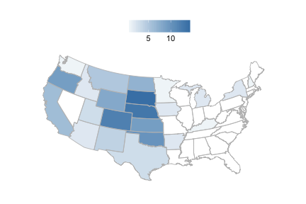
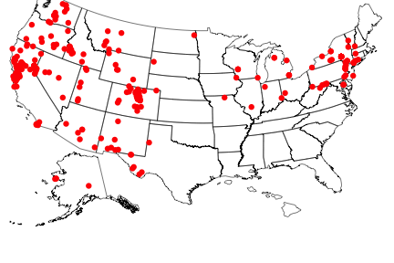

<!--
%\VignetteEngine{knitr}
%\VignetteIndexEntry{An R Markdown Vignette made with knitr}
-->

rbison vignette - wrapper to the USGS BISON API
======

### About the package

`rbison` is an R package to search and retrieve data from the USGS BISON service. `rbison` wraps R code around the BISON API to allow you to talk to the BISON database from R. 

BISON has occurrence data for the US only. 

BISON is a node of the Global Biodiversity Information Facility (GBIF) - i.e., you can get data that's available in BISON via GBIF instead if you want. 

********************

### Info

See [here](http://bison.usgs.ornl.gov/services.html) for API docs for the BISON API.

********************

### Quick start

#### Install rbison


```r
# install.packages('devtools'); library(devtools); install_github('rbison',
# 'ropensci')
library(rbison)
library(sp)
library(plyr)
library(httr)
library(rjson)
library(gridExtra)
library(mapproj)
library(ggplot2)
library(maps)
library(rgeos)
library(rgdal)
```


Notice that the function `bisonmap` automagically selects the map extent to plot for you, 
being one of the contiguous lower 48 states, or the lower 48 plus AK and HI, or a global map

#### If some or all points outside the US, a global map is drawn, and throws a warning. You may want to make sure the occurrence lat/long coordinates are correct.

##### get data


```r
out <- bison(species = "Helianthus annuus", count = 10)
```


##### inspect summary


```r
out$summary
```

```
##   total observation fossil specimen literature unknown living centroid
## 1  4388          13    102     1267       1106    1892      8        1
```


##### map occurrences

```r
head(out$counties)
```

```
##   record_id total      county_name         state
## 1     20041     3 Dickinson County        Kansas
## 2     54103     1    Wetzel County West Virginia
## 3     40149     1   Washita County      Oklahoma
## 4     54105     1      Wirt County West Virginia
## 5     29025     1  Caldwell County      Missouri
## 6     40143     2     Tulsa County      Oklahoma
```


********************

#### All points within the US (including AK and HI)
##### get data

```r
out <- bison(species = "Bison bison", count = 600)
```


##### inspect summary

```r
out$summary
```

```
##   total observation fossil specimen unknown centroid
## 1   956          32    157      718      49        1
```


##### map occurrences

```r
bisonmap(out, tomap = "state")
```

 


********************

####  All points within the contiguous 48 states
##### get data

```r
out <- bison(species = "Aquila chrysaetos", count = 600)
```


##### inspect summary

```r
out$summary
```

```
##   total observation fossil specimen literature unknown centroid
## 1 52626       50896    105      799        118     708        1
```


##### map occurrences

```r
bisonmap(out, tomap = "points")
```

 


********************

####  With any data returned from a `bison` call, you can choose to plot county or state level data
##### Counties - using last data call for Aquila 

```r
bisonmap(out, tomap = "county")
```

 


##### States - using last data call for Aquila 

```r
bisonmap(out, tomap = "state")
```

 


********************

####  Constrain search with county IDs or bounding boxes

##### Constrain search to a certain county.

Check out [this site](http://www.epa.gov/enviro/html/codes/state.html) to get state and county fips codes. Fips codes are like so: First two digits are the state code - last three are the county code. For example the *06* in  06037 is the state of California, and the *037* is the Los Angeles county.


```r
out <- bison(species = "Helianthus annuus", countyFips = "06037")

# Inspect summary
out$summary
```

```
##   total observation fossil specimen literature unknown centroid
## 1    24           1      3       12          1       7        1
```

```r

# By default, the query only returned 10 records
head(out$points)
```

```
##                name decimalLongitude decimalLatitude occurrenceID
## 1 Helianthus annuus           -118.4           33.39   1032095838
## 2 Helianthus annuus           -118.3           34.20     45597818
## 3 Helianthus annuus           -118.0           34.00    225207520
## 4 Helianthus annuus           -118.0           34.00    225206595
## 5 Helianthus annuus           -118.0           34.00    225207727
## 6 Helianthus annuus           -118.0           34.00    225207562
##                            provider      basis
## 1              USDA PLANTS Database Literature
## 2   University of California, Davis    Unknown
## 3 Consortium of California Herbaria   Specimen
## 4 Consortium of California Herbaria   Specimen
## 5 Consortium of California Herbaria   Specimen
## 6 Consortium of California Herbaria   Specimen
##                                                     common_name geo
## 1 sunflower, annual sunflower, common sunflower, wild sunflower Yes
## 2 sunflower, annual sunflower, common sunflower, wild sunflower Yes
## 3 sunflower, annual sunflower, common sunflower, wild sunflower Yes
## 4 sunflower, annual sunflower, common sunflower, wild sunflower Yes
## 5 sunflower, annual sunflower, common sunflower, wild sunflower Yes
## 6 sunflower, annual sunflower, common sunflower, wild sunflower Yes
```


Or specify county by its actual name - probably much easier. 


```r
out <- bison(species = "Helianthus annuus", county = "Los Angeles")

# Inspect summary
out$summary
```

```
##   total observation fossil specimen literature unknown centroid
## 1    24           1      3       12          1       7        1
```

```r

# By default, the query only returned 10 records
head(out$points)
```

```
##                name decimalLongitude decimalLatitude occurrenceID
## 1 Helianthus annuus           -118.4           33.39   1032095838
## 2 Helianthus annuus           -118.3           34.20     45597818
## 3 Helianthus annuus           -118.0           34.00    225207520
## 4 Helianthus annuus           -118.0           34.00    225206595
## 5 Helianthus annuus           -118.0           34.00    225207727
## 6 Helianthus annuus           -118.0           34.00    225207562
##                            provider      basis
## 1              USDA PLANTS Database Literature
## 2   University of California, Davis    Unknown
## 3 Consortium of California Herbaria   Specimen
## 4 Consortium of California Herbaria   Specimen
## 5 Consortium of California Herbaria   Specimen
## 6 Consortium of California Herbaria   Specimen
##                                                     common_name geo
## 1 sunflower, annual sunflower, common sunflower, wild sunflower Yes
## 2 sunflower, annual sunflower, common sunflower, wild sunflower Yes
## 3 sunflower, annual sunflower, common sunflower, wild sunflower Yes
## 4 sunflower, annual sunflower, common sunflower, wild sunflower Yes
## 5 sunflower, annual sunflower, common sunflower, wild sunflower Yes
## 6 sunflower, annual sunflower, common sunflower, wild sunflower Yes
```


`bison` will help you if you spell the name wrong, or use a partial name. The results are not printed below, but you would get a prompt asking you to pick between the two counties that start with *Los*.


```r
bison(species = "Helianthus annuus", county = "Los")
```


##### Constrain search to a amorphous area. 

Check out the Wikipedia page [here](http://en.wikipedia.org/wiki/Well-known_text) for an in depth look at the options, terminology, etc.


```r
out <- bison(species = "Helianthus annuus", aoi = "POLYGON((-111.06360117772908 38.84001566645886,-110.80542246679359 39.37707771107983,-110.20117441992392 39.17722368276862,-110.20666758398464 38.90844075244811,-110.63513438085685 38.67724220095734,-111.06360117772908 38.84001566645886))")

# Inspect summary
out$summary
```

```
##   total literature centroid
## 1     1          1        1
```

```r

# The data
head(out$points)
```

```
##                name decimalLongitude decimalLatitude occurrenceID
## 1 Helianthus annuus           -110.7           38.99   1032098012
##               provider      basis
## 1 USDA PLANTS Database Literature
##                                                     common_name geo
## 1 sunflower, annual sunflower, common sunflower, wild sunflower Yes
```


##### Constrain search to a certain aoibbox.

An aoibbox uses the format minx, miny, maxx, maxy.


```r
out <- bison(species = "Helianthus annuus", aoibbox = "-120.31,35.81,-110.57,40.21")

# Inspect summary
out$summary
```

```
##   total observation fossil specimen literature unknown centroid
## 1   149           6      8       33         25      77        1
```

```r

# The data, by default, the query only returned 10 records
head(out$points)
```

```
##                name decimalLongitude decimalLatitude occurrenceID
## 1 Helianthus annuus           -115.0           36.21    320466814
## 2 Helianthus annuus           -111.8           35.83    320466028
## 3 Helianthus annuus           -119.7           36.76     45598447
## 4 Helianthus annuus           -119.7           36.76     45598264
## 5 Helianthus annuus           -111.8           35.84   1032095762
## 6 Helianthus annuus           -115.0           36.20   1032096818
##                          provider      basis
## 1       Missouri Botanical Garden   Specimen
## 2       Missouri Botanical Garden   Specimen
## 3 University of California, Davis    Unknown
## 4 University of California, Davis    Unknown
## 5            USDA PLANTS Database Literature
## 6            USDA PLANTS Database Literature
##                                                     common_name geo
## 1 sunflower, annual sunflower, common sunflower, wild sunflower Yes
## 2 sunflower, annual sunflower, common sunflower, wild sunflower Yes
## 3 sunflower, annual sunflower, common sunflower, wild sunflower Yes
## 4 sunflower, annual sunflower, common sunflower, wild sunflower Yes
## 5 sunflower, annual sunflower, common sunflower, wild sunflower Yes
## 6 sunflower, annual sunflower, common sunflower, wild sunflower Yes
```

