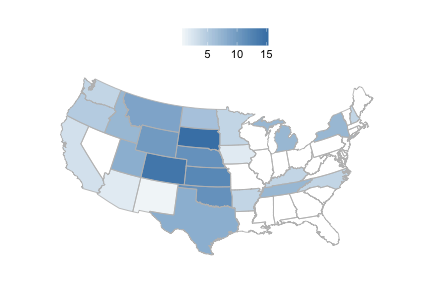
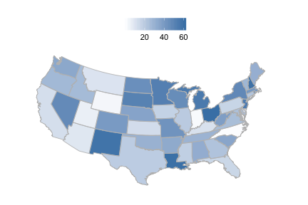

<!--
%\VignetteEngine{knitr}
%\VignetteIndexEntry{rbison introduction}
%\VignetteEncoding{UTF-8}
-->


rbison introduction
======

## About the package

`rbison` is an R package to search and retrieve data from the USGS BISON service. `rbison` wraps R code around the BISON API to allow you to talk to the BISON database from R.

BISON has occurrence data for the US only.

BISON is a node of the Global Biodiversity Information Facility (GBIF) - i.e., you can get data that's available in BISON via GBIF instead if you want.

## Info

See <https://bison.usgs.gov/doc/api.jsp> for API docs for the BISON API.


## Install rbison


```r
install.packages("rbison")
```

Or install development version from Github


```r
install.packages("devtools")
devtools::install_github("ropensci/rbison")
```

Load packages


```r
library('rbison')
```

Notice that the function `bisonmap` automagically selects the map extent to plot for you, being one of the contiguous lower 48 states, or the lower 48 plus AK and HI, or a global map. If some or all points outside the US, a global map is drawn, and throws a warning. You may want to make sure the occurrence lat/long coordinates are correct.

## Get data


```r
out <- bison(species = "Helianthus annuus", count = 10)
```

Inspect summary


```r
out$summary
#>   occurrences.legend.living occurrences.legend.observation
#> 1                         6                            746
#>   occurrences.legend.centroid occurrences.legend.specimen
#> 1                           1                        3709
#>   occurrences.legend.unknown living observation centroid specimen unknown
#> 1                       1521      6         746        1     3709    1521
```

Map occurrences


```r
head(out$counties)
#>   record_id total      county_name        state
#> 1     39075     1    Holmes County         Ohio
#> 2     42003     1 Allegheny County Pennsylvania
#> 3     40063     1    Hughes County     Oklahoma
#> 4     39077     1     Huron County         Ohio
#> 5     17043     2    DuPage County     Illinois
#> 6     40067     2 Jefferson County     Oklahoma
```

## All points within the US (including AK and HI)

Get data


```r
out <- bison(species="Bison bison", count=200)
```

Inspect summary


```r
out$summary
#>   occurrences.legend.fossil occurrences.legend.observation
#> 1                       359                            927
#>   occurrences.legend.centroid occurrences.legend.specimen
#> 1                           1                         946
#>   occurrences.legend.unknown fossil observation centroid specimen unknown
#> 1                          6    359         927        1      946       6
```

Map occurrences


```r
bisonmap(out, tomap="state")
```



## All points within the contiguous 48 states

Get data


```r
out <- bison(species="Aquila chrysaetos", count=400)
```

Inspect summary


```r
out$summary
#>   occurrences.legend.literature occurrences.legend.fossil
#> 1                          1641                       642
#>   occurrences.legend.observation occurrences.legend.centroid
#> 1                         128207                           1
#>   occurrences.legend.unknown occurrences.legend.specimen literature fossil
#> 1                       9734                        1899       1641    642
#>   observation centroid unknown specimen
#> 1      128207        1    9734     1899
```

Map occurrences


```r
bisonmap(out, tomap="points")
```


## Plot county or state

With any data returned from a `bison` call, you can choose to plot county or state level data

Counties - using last data call for Aquila


```r
bisonmap(out, tomap="county")
```


States - using last data call for Aquila


```r
bisonmap(out, tomap="state")
```



## Constrain search with county IDs or bounding boxes

### Constrain search to a certain county.

Check out [this site](http://www.epa.gov/enviro/html/codes/state.html) to get state and county fips codes. Fips codes are like so: First two digits are the state code - last three are the county code. For example the *06* in  06037 is the state of California, and the *037* is the Los Angeles county.


```r
out <- bison(species="Helianthus annuus", countyFips = "06037")
```

Inspect summary


```r
out$summary
#>   occurrences.legend.living occurrences.legend.observation
#> 1                         6                            746
#>   occurrences.legend.centroid occurrences.legend.specimen
#> 1                           1                        3709
#>   occurrences.legend.unknown living observation centroid specimen unknown
#> 1                       1521      6         746        1     3709    1521
```

By default, the query only returned 10 records


```r
head(out$points)
#>                name decimalLongitude decimalLatitude occurrenceID
#> 1 Helianthus annuus        -122.3671        39.01127   1021808881
#> 2 Helianthus annuus        -122.3308        47.60639   1258590900
#> 3 Helianthus annuus        -122.3037        41.35260   1020858079
#> 4 Helianthus annuus        -122.1928        38.82917     40886974
#> 5 Helianthus annuus        -122.1692        37.42722   1022012170
#> 6 Helianthus annuus        -122.1389        39.44917   1021150634
#>                             provider    basis
#> 1  Consortium of California Herbaria Specimen
#> 2          Missouri Botanical Garden Specimen
#> 3  Consortium of California Herbaria Specimen
#> 4 US National Plant Germplasm System  Unknown
#> 5  Consortium of California Herbaria Specimen
#> 6  Consortium of California Herbaria Specimen
#>                                                     common_name geo
#> 1 annual sunflower, sunflower, wild sunflower, common sunflower Yes
#> 2 annual sunflower, sunflower, wild sunflower, common sunflower Yes
#> 3 annual sunflower, sunflower, wild sunflower, common sunflower Yes
#> 4 annual sunflower, sunflower, wild sunflower, common sunflower Yes
#> 5 annual sunflower, sunflower, wild sunflower, common sunflower Yes
#> 6 annual sunflower, sunflower, wild sunflower, common sunflower Yes
```

Or specify county by its actual name - probably much easier.


```r
out <- bison(species="Helianthus annuus", county = "Los Angeles")
```

Inspect summary


```r
out$summary
#>   occurrences.legend.observation occurrences.legend.centroid
#> 1                             24                           1
#>   occurrences.legend.specimen occurrences.legend.unknown observation
#> 1                          59                          6          24
#>   centroid specimen unknown
#> 1        1       59       6
```

By default, the query only returned 10 records


```r
head(out$points)
#>                name decimalLongitude decimalLatitude occurrenceID
#> 1 Helianthus annuus        -118.7203        34.08030   1488148453
#> 2 Helianthus annuus        -118.8517        34.79611     40886955
#> 3 Helianthus annuus        -118.8517        34.79611     40886954
#> 4 Helianthus annuus        -118.8286        34.12916   1132411638
#> 5 Helianthus annuus        -118.8285        34.12966   1132402545
#> 6 Helianthus annuus        -118.7944        34.70194   1021481336
#>                             provider       basis
#> 1                              BISON Observation
#> 2 US National Plant Germplasm System     Unknown
#> 3 US National Plant Germplasm System     Unknown
#> 4                    iNaturalist.org Observation
#> 5                    iNaturalist.org Observation
#> 6  Consortium of California Herbaria    Specimen
#>                                                     common_name geo
#> 1 annual sunflower, sunflower, wild sunflower, common sunflower Yes
#> 2 annual sunflower, sunflower, wild sunflower, common sunflower Yes
#> 3 annual sunflower, sunflower, wild sunflower, common sunflower Yes
#> 4 annual sunflower, sunflower, wild sunflower, common sunflower Yes
#> 5 annual sunflower, sunflower, wild sunflower, common sunflower Yes
#> 6 annual sunflower, sunflower, wild sunflower, common sunflower Yes
```

`bison` will help you if you spell the name wrong, or use a partial name. The results are not printed below, but you would get a prompt asking you to pick between the two counties that start with *Los*.


```r
bison(species="Helianthus annuus", county = "Los")
```

### Constrain search to a amorphous area.

Check out the Wikipedia page [here](http://en.wikipedia.org/wiki/Well-known_text) for an in depth look at the options, terminology, etc.


```r
out <- bison(species="Helianthus annuus", aoi = "POLYGON((-111.06360117772908 38.84001566645886,-110.80542246679359 39.37707771107983,-110.20117441992392 39.17722368276862,-110.20666758398464 38.90844075244811,-110.63513438085685 38.67724220095734,-111.06360117772908 38.84001566645886))")
```

Inspect summary


```r
out$summary
#>   occurrences.legend.centroid occurrences.legend.specimen centroid
#> 1                           1                           1        1
#>   specimen
#> 1        1
```

The data


```r
out$points
#>                name decimalLongitude decimalLatitude occurrenceID provider
#> 1 Helianthus annuus        -110.7211        39.00903   1419799586    BISON
#>      basis                                                   common_name
#> 1 Specimen annual sunflower, sunflower, wild sunflower, common sunflower
#>   geo
#> 1 Yes
```

### Constrain search to a certain aoibbox.

An aoibbox uses the format minx, miny, maxx, maxy.


```r
out <- bison(species="Helianthus annuus", aoibbox = '-120.31,35.81,-110.57,40.21')
```

Inspect summary


```r
out$summary
#>   occurrences.legend.observation occurrences.legend.centroid
#> 1                             43                           1
#>   occurrences.legend.specimen occurrences.legend.unknown observation
#> 1                          92                         72          43
#>   centroid specimen unknown
#> 1        1       92      72
```

The data, by default, the query only returned 10 records


```r
head(out$points)
#>                name decimalLongitude decimalLatitude occurrenceID provider
#> 1 Helianthus annuus        -113.7000        36.40001   1429539601    BISON
#> 2 Helianthus annuus        -119.7417        36.94192   1493585452    BISON
#> 3 Helianthus annuus        -111.4509        37.83162   1475891938    BISON
#> 4 Helianthus annuus        -111.4509        37.83162   1475891939    BISON
#> 5 Helianthus annuus        -111.7549        37.12521   1475815079    BISON
#> 6 Helianthus annuus        -111.7549        37.12521   1475815080    BISON
#>         basis
#> 1 Observation
#> 2 Observation
#> 3 Observation
#> 4 Observation
#> 5 Observation
#> 6 Observation
#>                                                     common_name geo
#> 1 annual sunflower, sunflower, wild sunflower, common sunflower Yes
#> 2 annual sunflower, sunflower, wild sunflower, common sunflower Yes
#> 3 annual sunflower, sunflower, wild sunflower, common sunflower Yes
#> 4 annual sunflower, sunflower, wild sunflower, common sunflower Yes
#> 5 annual sunflower, sunflower, wild sunflower, common sunflower Yes
#> 6 annual sunflower, sunflower, wild sunflower, common sunflower Yes
```
