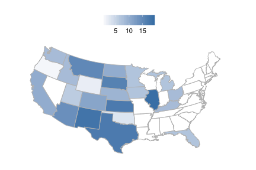
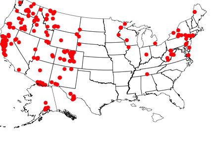
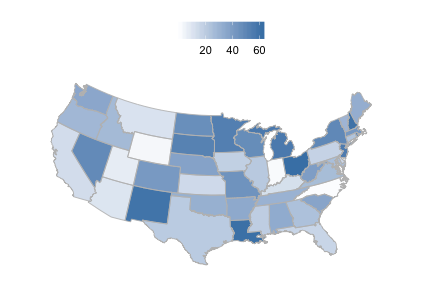

<!--
%\VignetteEngine{knitr}
%\VignetteIndexEntry{rbison introduction}
%\VignetteEncoding{UTF-8}
-->


rbison introduction
======

## About the package

`rbison` is an R package to search and retrieve data from the USGS BISON service. `rbison` wraps R code around the BISON API to allow you to talk to the BISON database from R.

BISON has occurrence data for the US only.

BISON is the US Node of GBIF and regularly updates from GBIF to have full coverage and is committed to eventually providing most BISON originating data to GBIF, however, users should be aware that several million BISON records are not in GBIF. The Solr API for BISON is fully open with no limits, allowing full batch download, faceting and geospatial searches on both DC fields and BISON added fields such as the full ITIS taxonomy, FIPS Codes, and georeferencing of county records to documented centroids.

## Info

See <https://bison.usgs.gov/doc/api.jsp> for API docs for the BISON API.


## Install rbison


```r
install.packages("rbison")
```

Or install development version from Github


```r
install.packages("devtools")
devtools::install_github("ropensci/rbison")
```

Load packages


```r
library('rbison')
```

Notice that the function `bisonmap` automagically selects the map extent to plot for you, being one of the contiguous lower 48 states, or the lower 48 plus AK and HI, or a global map. If some or all points outside the US, a global map is drawn, and throws a warning. You may want to make sure the occurrence lat/long coordinates are correct.

## Get data


```r
out <- bison(species = "Helianthus annuus", count = 10)
```

Inspect summary


```r
out$summary
#> $literature
#> [1] 1
#> 
#> $living
#> [1] 120
#> 
#> $observation
#> [1] 1546
#> 
#> $centroid
#> [1] 1
#> 
#> $unknown
#> [1] 4506
#> 
#> $specimen
#> [1] 4269
```

Map occurrences


```r
head(out$counties)
#>   record_id total      county_name        state
#> 1     42003     2 Allegheny County Pennsylvania
#> 2     39075     1    Holmes County         Ohio
#> 3     40063     2    Hughes County     Oklahoma
#> 4     39077     1     Huron County         Ohio
#> 5     17043     3    DuPage County     Illinois
#> 6     40067     2 Jefferson County     Oklahoma
```

## All points within the US (including AK and HI)

Get data


```r
out <- bison(species="Bison bison", count=200)
```

Inspect summary


```r
out$summary
#> $fossil
#> [1] 350
#> 
#> $observation
#> [1] 822
#> 
#> $centroid
#> [1] 1
#> 
#> $specimen
#> [1] 1038
#> 
#> $unknown
#> [1] 6
```

Map occurrences


```r
bisonmap(out, tomap="state")
```



## All points within the contiguous 48 states

Get data


```r
out <- bison(species="Aquila chrysaetos", count=400)
```

Inspect summary


```r
out$summary
#> $fossil
#> [1] 681
#> 
#> $observation
#> [1] 159076
#> 
#> $centroid
#> [1] 1
#> 
#> $unknown
#> [1] 11046
#> 
#> $specimen
#> [1] 1911
```

Map occurrences


```r
bisonmap(out, tomap="points")
```



## Plot county or state

With any data returned from a `bison` call, you can choose to plot county or state level data

Counties - using last data call for Aquila


```r
bisonmap(out, tomap="county")
```


States - using last data call for Aquila


```r
bisonmap(out, tomap="state")
```



## Constrain search with county IDs or bounding boxes

### Constrain search to a certain county.

Check out [this site](http://www.epa.gov/enviro/html/codes/state.html) to get state and county fips codes. Fips codes are like so: First two digits are the state code - last three are the county code. For example the *06* in  06037 is the state of California, and the *037* is the Los Angeles county.


```r
out <- bison(species="Helianthus annuus", countyFips = "06037")
```

Inspect summary


```r
out$summary
#> $literature
#> [1] 1
#> 
#> $living
#> [1] 120
#> 
#> $observation
#> [1] 1546
#> 
#> $centroid
#> [1] 1
#> 
#> $unknown
#> [1] 4506
#> 
#> $specimen
#> [1] 4269
```

By default, the query only returned 10 records


```r
head(out$points)
#>                name decimalLongitude decimalLatitude occurrenceID
#> 1 Helianthus annuus        -97.10123        32.58398   1562942729
#> 2 Helianthus annuus        -82.10396        39.32974   1806327538
#> 3 Helianthus annuus       -117.87833        34.15750   1806142012
#> 4 Helianthus annuus       -111.92707        40.42877   1849106705
#> 5 Helianthus annuus        -82.76860        28.08310   1503264462
#> 6 Helianthus annuus        -82.15190        26.69580   1503248175
#>                            provider       basis
#> 1                   iNaturalist.org Observation
#> 2                   iNaturalist.org Observation
#> 3 Consortium of California Herbaria    Specimen
#> 4      University of South Carolina    Specimen
#> 5               USF Water Institute    Specimen
#> 6               USF Water Institute    Specimen
#>                                                     common_name geo
#> 1 sunflower, common sunflower, wild sunflower, annual sunflower Yes
#> 2 sunflower, common sunflower, wild sunflower, annual sunflower Yes
#> 3 sunflower, common sunflower, wild sunflower, annual sunflower Yes
#> 4 sunflower, common sunflower, wild sunflower, annual sunflower Yes
#> 5 sunflower, common sunflower, wild sunflower, annual sunflower Yes
#> 6 sunflower, common sunflower, wild sunflower, annual sunflower Yes
```

Or specify county by its actual name - probably much easier.


```r
out <- bison(species="Helianthus annuus", county = "Los Angeles")
```

Inspect summary


```r
out$summary
#> $observation
#> [1] 76
#> 
#> $centroid
#> [1] 1
#> 
#> $unknown
#> [1] 125
#> 
#> $specimen
#> [1] 120
```

By default, the query only returned 10 records


```r
head(out$points)
#>                name decimalLongitude decimalLatitude occurrenceID
#> 1 Helianthus annuus        -117.8783        34.15750   1806142012
#> 2 Helianthus annuus        -118.2619        34.19640   1662962204
#> 3 Helianthus annuus        -118.2619        34.19640   1662956437
#> 4 Helianthus annuus        -118.6458        34.73667   1426396995
#> 5 Helianthus annuus        -118.1027        34.00193   1453145324
#> 6 Helianthus annuus        -118.2272        34.07040   1453104714
#>                            provider       basis
#> 1 Consortium of California Herbaria    Specimen
#> 2 Consortium of California Herbaria    Specimen
#> 3 Consortium of California Herbaria    Specimen
#> 4    California Academy of Sciences    Specimen
#> 5                   iNaturalist.org Observation
#> 6                   iNaturalist.org Observation
#>                                                     common_name geo
#> 1 sunflower, common sunflower, wild sunflower, annual sunflower Yes
#> 2 sunflower, common sunflower, wild sunflower, annual sunflower Yes
#> 3 sunflower, common sunflower, wild sunflower, annual sunflower Yes
#> 4 sunflower, common sunflower, wild sunflower, annual sunflower Yes
#> 5 sunflower, common sunflower, wild sunflower, annual sunflower Yes
#> 6 sunflower, common sunflower, wild sunflower, annual sunflower Yes
```

`bison` will help you if you spell the name wrong, or use a partial name. The results are not printed below, but you would get a prompt asking you to pick between the two counties that start with *Los*.


```r
bison(species="Helianthus annuus", county = "Los")
```

### Constrain search to a amorphous area.

Check out the Wikipedia page [here](http://en.wikipedia.org/wiki/Well-known_text) for an in depth look at the options, terminology, etc.


```r
out <- bison(species="Helianthus annuus", aoi = "POLYGON((-111.06360117772908 38.84001566645886,-110.80542246679359 39.37707771107983,-110.20117441992392 39.17722368276862,-110.20666758398464 38.90844075244811,-110.63513438085685 38.67724220095734,-111.06360117772908 38.84001566645886))")
```

Inspect summary


```r
out$summary
#> $specimen
#> [1] 1
```

The data


```r
out$points
#>                name decimalLongitude decimalLatitude occurrenceID provider
#> 1 Helianthus annuus        -110.7211        39.00903   2066046849    BISON
#>      basis                                                   common_name
#> 1 Specimen sunflower, common sunflower, wild sunflower, annual sunflower
#>   geo
#> 1 Yes
```

### Constrain search to a certain aoibbox.

An aoibbox uses the format minx, miny, maxx, maxy.


```r
out <- bison(species="Helianthus annuus", aoibbox = '-120.31,35.81,-110.57,40.21')
```

Inspect summary


```r
out$summary
#> $observation
#> [1] 61
#> 
#> $centroid
#> [1] 1
#> 
#> $unknown
#> [1] 293
#> 
#> $specimen
#> [1] 165
```

The data, by default, the query only returned 10 records


```r
head(out$points)
#>                name decimalLongitude decimalLatitude occurrenceID
#> 1 Helianthus annuus        -113.4878        37.26253   1302624267
#> 2 Helianthus annuus        -114.0387        37.14930   1098240278
#> 3 Helianthus annuus        -119.3294        36.72222   1426396940
#> 4 Helianthus annuus        -116.4590        37.96638   1300519392
#> 5 Helianthus annuus        -116.4590        37.96638   1300519403
#> 6 Helianthus annuus        -116.4590        37.96638   1300519404
#>                                              provider    basis
#> 1 Centro Internacional de Agricultura Tropical (CIAT)  Unknown
#> 2                       The New York Botanical Garden Specimen
#> 3                      California Academy of Sciences Specimen
#> 4 Centro Internacional de Agricultura Tropical (CIAT)  Unknown
#> 5 Centro Internacional de Agricultura Tropical (CIAT)  Unknown
#> 6 Centro Internacional de Agricultura Tropical (CIAT)  Unknown
#>                                                     common_name geo
#> 1 sunflower, common sunflower, wild sunflower, annual sunflower Yes
#> 2 sunflower, common sunflower, wild sunflower, annual sunflower Yes
#> 3 sunflower, common sunflower, wild sunflower, annual sunflower Yes
#> 4 sunflower, common sunflower, wild sunflower, annual sunflower Yes
#> 5 sunflower, common sunflower, wild sunflower, annual sunflower Yes
#> 6 sunflower, common sunflower, wild sunflower, annual sunflower Yes
```
