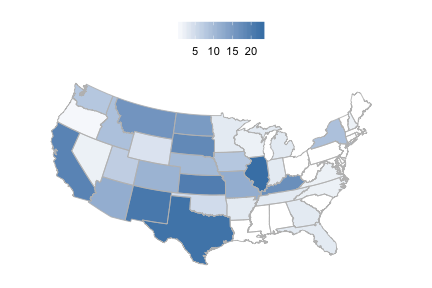
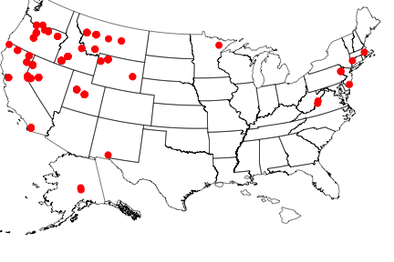
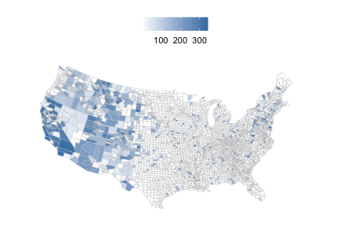

```{r echo=FALSE}
NOT_CRAN <- identical(tolower(Sys.getenv("NOT_CRAN")), "true")
knitr::opts_chunk$set(
  fig.width = 6,
  fig.height = 4,
  comment = "#>",
  collapse = TRUE,
  warning = FALSE,
  message = FALSE,
  purl = NOT_CRAN,
  eval = NOT_CRAN
)
```

`rbison` is an R package to search and retrieve data from the USGS BISON service. `rbison` wraps R code around the BISON API to allow you to talk to the BISON database from R.

BISON has occurrence data for the US only.

BISON is the US Node of GBIF and regularly updates from GBIF to have full coverage and is committed to eventually providing most BISON originating data to GBIF, however, users should be aware that several million BISON records are not in GBIF. The Solr API for BISON is fully open with no limits, allowing full batch download, faceting and geospatial searches on both DC fields and BISON added fields such as the full ITIS taxonomy, FIPS Codes, and georeferencing of county records to documented centroids.

## Info

See https://bison.usgs.gov/doc/api.jsp for API docs for the BISON API.


## Install rbison

```{r install, eval=FALSE}
install.packages("rbison")
```

Or install development version from Github

```{r install2, eval=FALSE}
install.packages("devtools")
devtools::install_github("ropensci/rbison")
```

Load packages

```{r load}
library('rbison')
```

Notice that the function `bisonmap` automagically selects the map extent to plot for you, being one of the contiguous lower 48 states, or the lower 48 plus AK and HI, or a global map. If some or all points outside the US, a global map is drawn, and throws a warning. You may want to make sure the occurrence lat/long coordinates are correct.

## Get data

```{r one}
out <- bison(species = "Helianthus annuus", count = 10)
```

Inspect summary

```{r two}
out$summary
```

Map occurrences

```{r}
head(out$counties)
```

## All points within the US (including AK and HI)

Get data

```{r four}
out <- bison(species="Bison bison", count=200)
```

Inspect summary

```{r five}
out$summary
```

Map occurrences

```{r six, eval=FALSE}
bisonmap(out, tomap="state")
```



## All points within the contiguous 48 states

Get data

```{r seven}
out <- bison(species="Aquila chrysaetos", count=400)
```

Inspect summary

```{r eight}
out$summary
```

Map occurrences

```{r nine, eval=FALSE}
bisonmap(out, tomap="points")
```



## Plot county or state

With any data returned from a `bison` call, you can choose to plot county or state level data

Counties - using last data call for Aquila

```{r ten, eval=FALSE}
bisonmap(out, tomap="county")
```



States - using last data call for Aquila

```{r eleven, eval=FALSE}
bisonmap(out, tomap="state")
```


## Constrain search with county IDs or bounding boxes

### Constrain search to a certain county.

Check out https://en.wikipedia.org/wiki/Federal_Information_Processing_Standard_state_code to get state and county fips codes. Fips codes are like so: First two digits are the state code - last three are the county code. For example the *06* in  06037 is the state of California, and the *037* is the Los Angeles county.

```{r countyfips}
out <- bison(species="Helianthus annuus", countyFips = "06037")
```

Inspect summary

```{r}
out$summary
```

By default, the query only returned 10 records

```{r}
head(out$points)
```

Or specify county by its actual name - probably much easier.

```{r countyname}
out <- bison(species="Helianthus annuus", county = "Los Angeles")
```

Inspect summary

```{r}
out$summary
```

By default, the query only returned 10 records

```{r}
head(out$points)
```

`bison` will help you if you spell the name wrong, or use a partial name. The results are not printed below, but you would get a prompt asking you to pick between the two counties that start with *Los*.

```{r countyname_wrong, eval=FALSE}
bison(species="Helianthus annuus", county = "Los")
```

### Constrain search to a amorphous area.

Check out http://en.wikipedia.org/wiki/Well-known_text for an in depth look at the options, terminology, etc.

```{r}
out <- bison(species="Helianthus annuus", aoi = "POLYGON((-111.06360117772908 38.84001566645886,-110.80542246679359 39.37707771107983,-110.20117441992392 39.17722368276862,-110.20666758398464 38.90844075244811,-110.63513438085685 38.67724220095734,-111.06360117772908 38.84001566645886))")
```

Inspect summary

```{r}
out$summary
```

The data

```{r}
out$points
```

### Constrain search to a certain aoibbox.

An aoibbox uses the format minx, miny, maxx, maxy.

```{r boundbox}
out <- bison(species="Helianthus annuus", aoibbox = '-120.31,35.81,-110.57,40.21')
```

Inspect summary

```{r}
out$summary
```

The data, by default, the query only returned 10 records

```{r}
head(out$points)
```
