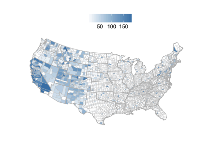
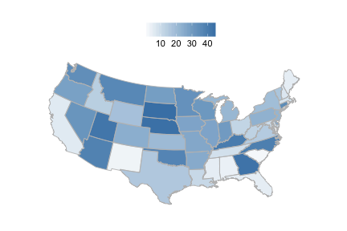

<!--
%\VignetteEngine{knitr}
%\VignetteIndexEntry{rbison introduction}
-->


rbison introduction
======

## About the package

`rbison` is an R package to search and retrieve data from the USGS BISON service. `rbison` wraps R code around the BISON API to allow you to talk to the BISON database from R. 

BISON has occurrence data for the US only. 

BISON is a node of the Global Biodiversity Information Facility (GBIF) - i.e., you can get data that's available in BISON via GBIF instead if you want. 

## Info

See [http://bison.usgs.ornl.gov/doc/api.jsp]() for API docs for the BISON API.


## Install rbison


```r
install.packages("rbison")
```

Or install development version from Github


```r
install.packages("devtools")
devtools::install_github("ropensci/rbison")
```

Load packages


```r
library('rbison')
```

Notice that the function `bisonmap` automagically selects the map extent to plot for you, being one of the contiguous lower 48 states, or the lower 48 plus AK and HI, or a global map. If some or all points outside the US, a global map is drawn, and throws a warning. You may want to make sure the occurrence lat/long coordinates are correct.

## Get data


```r
out <- bison(species = "Helianthus annuus", count = 10)
```

Inspect summary


```r
out$summary
#>   total observation fossil specimen unknown living centroid
#> 1  5108          37    102     3499    1468      2        1
```

Map occurrences


```r
head(out$counties)
#>   record_id total      county_name         state
#> 1     20041     3 Dickinson County        Kansas
#> 2     54103     1    Wetzel County West Virginia
#> 3     40149     1   Washita County      Oklahoma
#> 4     54105     1      Wirt County West Virginia
#> 5     29025     1  Caldwell County      Missouri
#> 6     40143     2     Tulsa County      Oklahoma
```

## All points within the US (including AK and HI)

Get data


```r
out <- bison(species="Bison bison", count=600)
```

Inspect summary


```r
out$summary
#>   total observation fossil specimen unknown centroid
#> 1  1432         132    164      897     239        1
```

Map occurrences


```r
bisonmap(out, tomap="state")
```

 

## All points within the contiguous 48 states

Get data


```r
out <- bison(species="Aquila chrysaetos", count=600)
```

Inspect summary


```r
out$summary
#>   total observation fossil specimen literature unknown centroid
#> 1 62862       51170    118      857        674   10043        1
```

Map occurrences


```r
bisonmap(out, tomap="points")
```

 

## Plot county or state 

With any data returned from a `bison` call, you can choose to plot county or state level data

Counties - using last data call for Aquila 


```r
bisonmap(out, tomap="county")
```

 

States - using last data call for Aquila 


```r
bisonmap(out, tomap="state")
```

 

## Constrain search with county IDs or bounding boxes

### Constrain search to a certain county.

Check out [this site](http://www.epa.gov/enviro/html/codes/state.html) to get state and county fips codes. Fips codes are like so: First two digits are the state code - last three are the county code. For example the *06* in  06037 is the state of California, and the *037* is the Los Angeles county.


```r
out <- bison(species="Helianthus annuus", countyFips = "06037")
```

Inspect summary


```r
out$summary
#>   total observation fossil specimen unknown living centroid
#> 1  5108          37    102     3499    1468      2        1
```

By default, the query only returned 10 records


```r
head(out$points)
#>                name decimalLongitude decimalLatitude occurrenceID
#> 1 Helianthus annuus           -122.6           38.11    868133992
#> 2 Helianthus annuus           -120.0           34.54    866815899
#> 3 Helianthus annuus           -108.6           39.06     40892504
#> 4 Helianthus annuus           -117.2           34.15    867605379
#> 5 Helianthus annuus           -101.2           38.48    176955508
#> 6 Helianthus annuus           -118.2           35.05     40891663
#>                                      provider    basis
#> 1           Consortium of California Herbaria Specimen
#> 2           Consortium of California Herbaria Specimen
#> 3          US National Plant Germplasm System  Unknown
#> 4           Consortium of California Herbaria Specimen
#> 5 University of Kansas Biodiversity Institute Specimen
#> 6          US National Plant Germplasm System  Unknown
#>                                                     common_name geo
#> 1 common sunflower, wild sunflower, annual sunflower, sunflower Yes
#> 2 common sunflower, wild sunflower, annual sunflower, sunflower Yes
#> 3 common sunflower, wild sunflower, annual sunflower, sunflower Yes
#> 4 common sunflower, wild sunflower, annual sunflower, sunflower Yes
#> 5 common sunflower, wild sunflower, annual sunflower, sunflower Yes
#> 6 common sunflower, wild sunflower, annual sunflower, sunflower Yes
```

Or specify county by its actual name - probably much easier. 


```r
out <- bison(species="Helianthus annuus", county = "Los Angeles")
```

Inspect summary


```r
out$summary
#>   total observation fossil specimen unknown centroid
#> 1   115           1      3      104       7        1
```

By default, the query only returned 10 records


```r
head(out$points)
#>                name decimalLongitude decimalLatitude occurrenceID
#> 1 Helianthus annuus           -118.4           34.06    919912581
#> 2 Helianthus annuus           -118.1           34.70     40886950
#> 3 Helianthus annuus           -117.8           34.45    867556726
#> 4 Helianthus annuus           -118.3           34.20    867698751
#> 5 Helianthus annuus           -118.3           34.20    868216748
#> 6 Helianthus annuus           -118.3           34.20    867920608
#>                             provider    basis
#> 1  Consortium of California Herbaria Specimen
#> 2 US National Plant Germplasm System  Unknown
#> 3  Consortium of California Herbaria Specimen
#> 4  Consortium of California Herbaria Specimen
#> 5  Consortium of California Herbaria Specimen
#> 6  Consortium of California Herbaria Specimen
#>                                                     common_name geo
#> 1 common sunflower, wild sunflower, annual sunflower, sunflower Yes
#> 2 common sunflower, wild sunflower, annual sunflower, sunflower Yes
#> 3 common sunflower, wild sunflower, annual sunflower, sunflower Yes
#> 4 common sunflower, wild sunflower, annual sunflower, sunflower Yes
#> 5 common sunflower, wild sunflower, annual sunflower, sunflower Yes
#> 6 common sunflower, wild sunflower, annual sunflower, sunflower Yes
```

`bison` will help you if you spell the name wrong, or use a partial name. The results are not printed below, but you would get a prompt asking you to pick between the two counties that start with *Los*.


```r
bison(species="Helianthus annuus", county = "Los")
```

### Constrain search to a amorphous area. 

Check out the Wikipedia page [here](http://en.wikipedia.org/wiki/Well-known_text) for an in depth look at the options, terminology, etc.


```r
out <- bison(species="Helianthus annuus", aoi = "POLYGON((-111.06360117772908 38.84001566645886,-110.80542246679359 39.37707771107983,-110.20117441992392 39.17722368276862,-110.20666758398464 38.90844075244811,-110.63513438085685 38.67724220095734,-111.06360117772908 38.84001566645886))")
```

Inspect summary


```r
out$summary
#>   total specimen centroid
#> 1     1        1        1
```

The data


```r
out$points
#>                name decimalLongitude decimalLatitude occurrenceID
#> 1 Helianthus annuus           -110.7           39.01   2174803257
#>               provider    basis
#> 1 USDA PLANTS Database Specimen
#>                                                     common_name geo
#> 1 common sunflower, wild sunflower, annual sunflower, sunflower Yes
```

### Constrain search to a certain aoibbox.

An aoibbox uses the format minx, miny, maxx, maxy.


```r
out <- bison(species="Helianthus annuus", aoibbox = '-120.31,35.81,-110.57,40.21')
```

Inspect summary


```r
out$summary
#>   total observation fossil specimen unknown centroid
#> 1   241           6      8      150      77        1
```

The data, by default, the query only returned 10 records


```r
head(out$points)
#>                name decimalLongitude decimalLatitude occurrenceID
#> 1 Helianthus annuus           -112.4           39.52     40892214
#> 2 Helianthus annuus           -111.2           36.11     40892493
#> 3 Helianthus annuus           -112.5           36.95     40892245
#> 4 Helianthus annuus           -111.8           37.14     57033814
#> 5 Helianthus annuus           -113.3           37.17     40892243
#> 6 Helianthus annuus           -119.4           36.35     40892467
#>                             provider    basis
#> 1 US National Plant Germplasm System  Unknown
#> 2 US National Plant Germplasm System  Unknown
#> 3 US National Plant Germplasm System  Unknown
#> 4   Utah Valley State College (UVSC) Specimen
#> 5 US National Plant Germplasm System  Unknown
#> 6 US National Plant Germplasm System  Unknown
#>                                                     common_name geo
#> 1 common sunflower, wild sunflower, annual sunflower, sunflower Yes
#> 2 common sunflower, wild sunflower, annual sunflower, sunflower Yes
#> 3 common sunflower, wild sunflower, annual sunflower, sunflower Yes
#> 4 common sunflower, wild sunflower, annual sunflower, sunflower Yes
#> 5 common sunflower, wild sunflower, annual sunflower, sunflower Yes
#> 6 common sunflower, wild sunflower, annual sunflower, sunflower Yes
```
